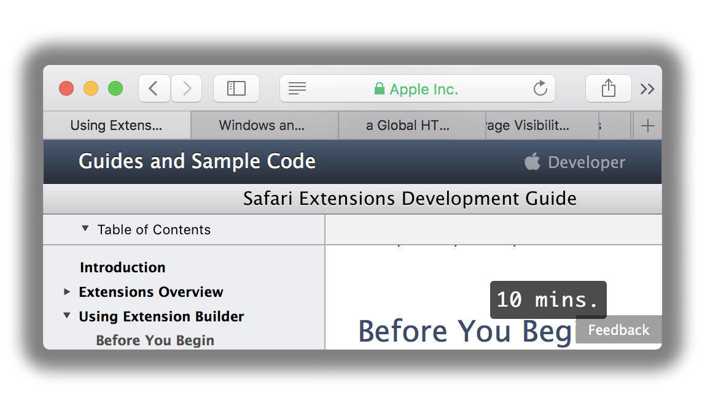

# Time To Read

> Safari extension - Displays the time estimation of how long it will take you to read the text on the page

## Install

By now, the only available installation is via downloading TimeToRead.safariext from this repository.
After downloading, double click on the file and Safari will prompt you to install the extension.

## License

MIT © [Trukhanov Artem](https://trukhanoff.com)